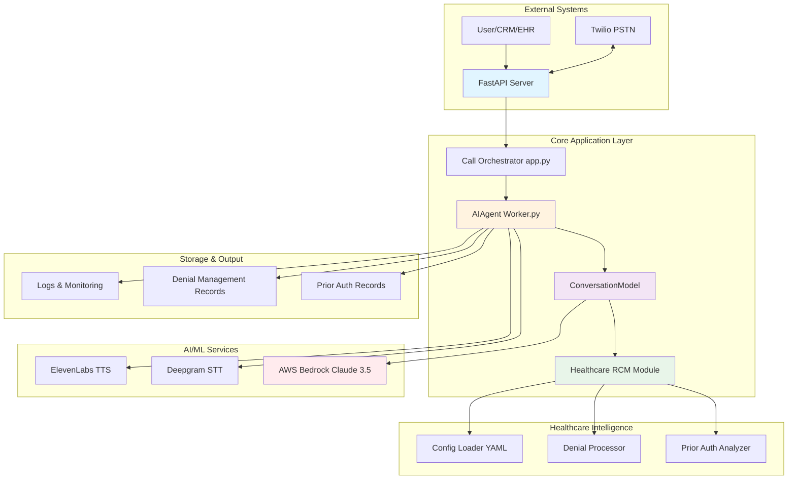
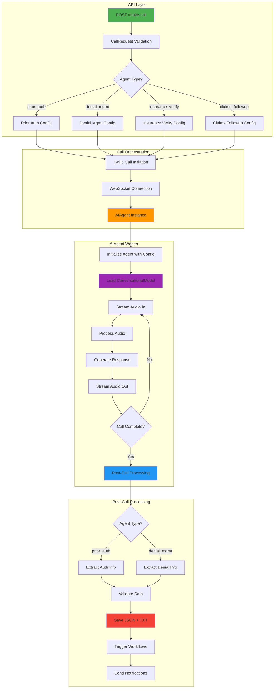
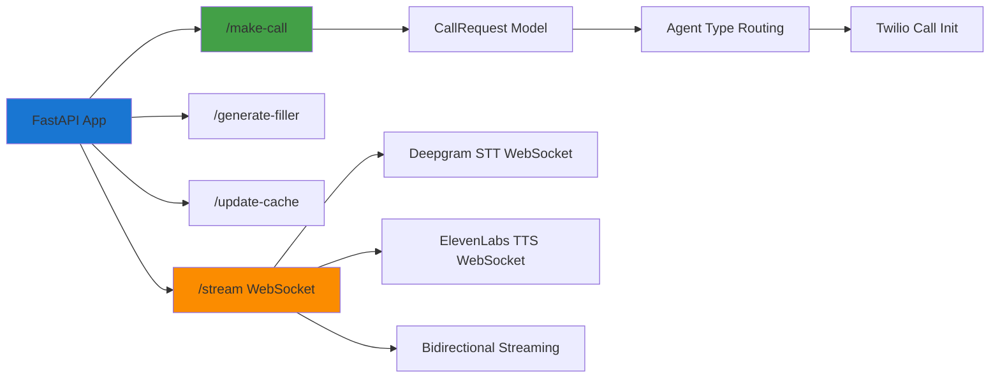
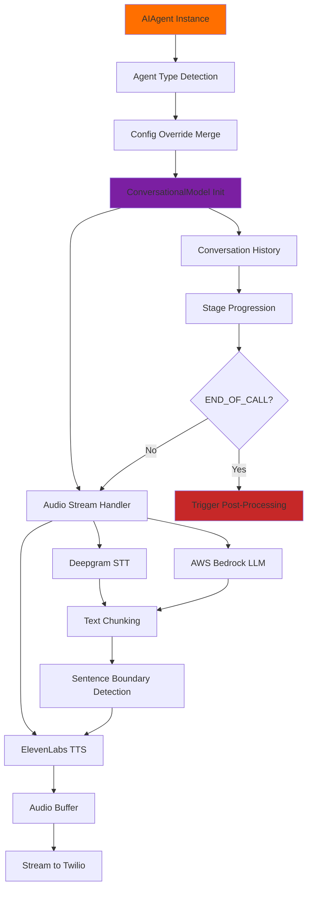
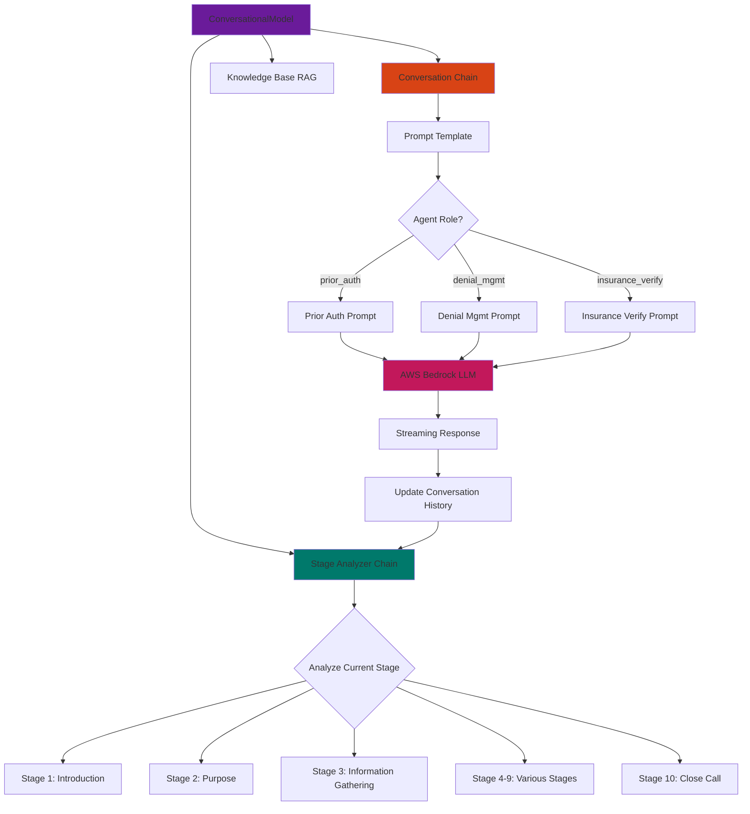
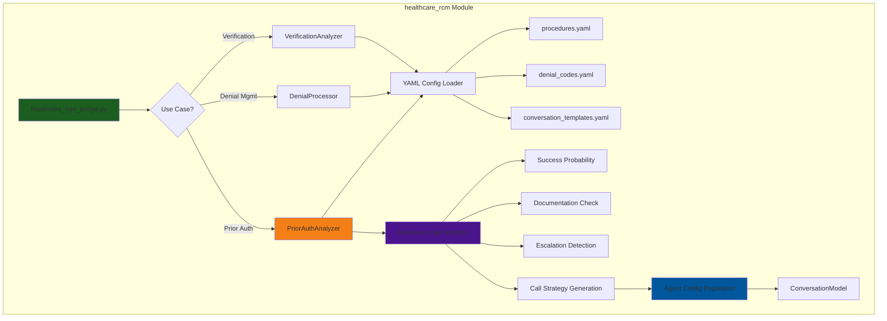
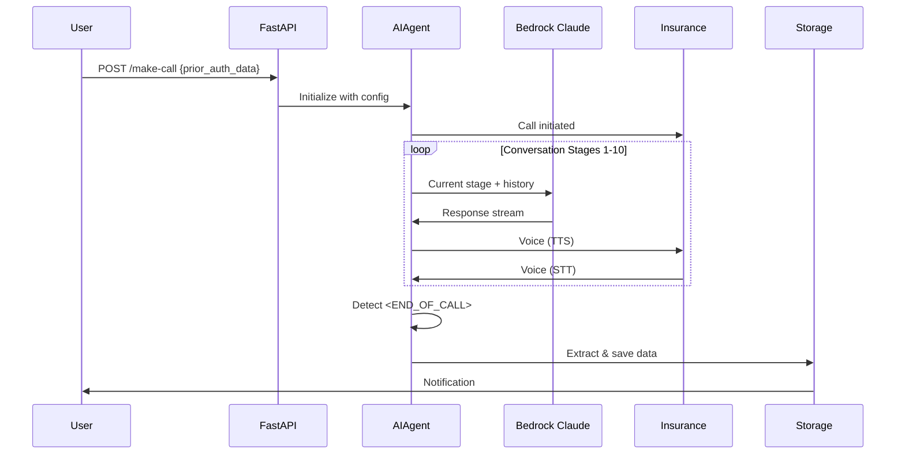
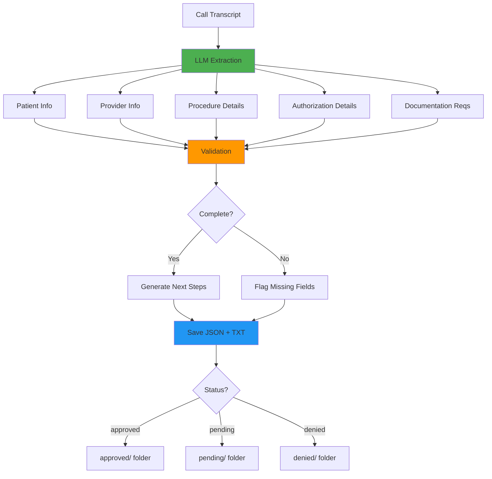
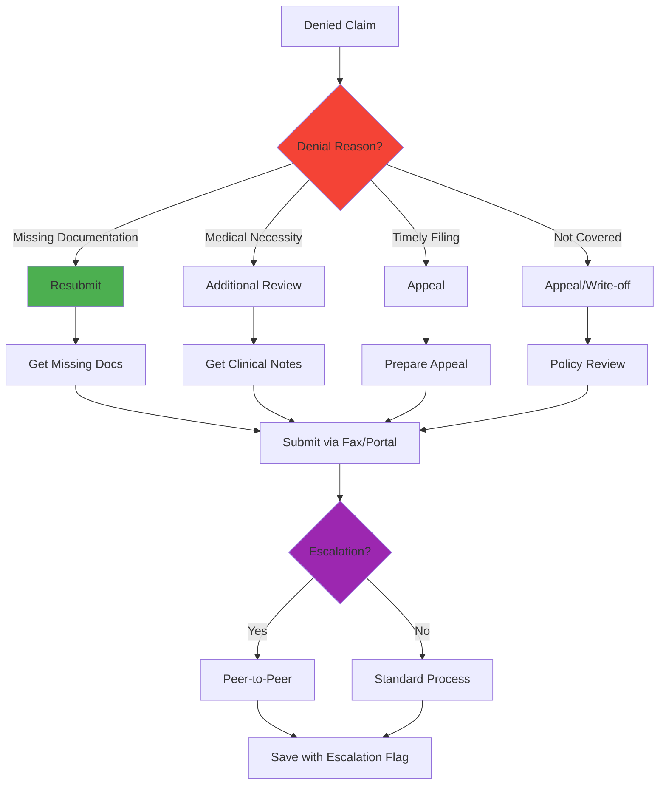

# 🏥 Outbound Phone GPT - Healthcare RCM Automation System
## Complete Architecture Documentation

---

## 📋 Table of Contents
1. [Project Overview](#project-overview)
2. [What This Project Does](#what-this-project-does)
3. [System Architecture](#system-architecture)
4. [Core Components](#core-components)
5. [Prior Authorization Workflow](#prior-authorization-workflow)
6. [Denial Management Workflow](#denial-management-workflow)
7. [Technology Stack](#technology-stack)

---

## 🎯 Project Overview

**Outbound Phone GPT** is an AI-powered voice automation system designed for **Healthcare Revenue Cycle Management (RCM)**. It autonomously handles outbound phone calls to insurance companies, automating repetitive tasks like prior authorizations, denial management, insurance verification, and claims follow-up.

### Key Innovation
- **AI-first approach**: Uses AWS Bedrock Claude 3.5 Sonnet for natural conversation
- **Real-time voice processing**: 1-2 second speech-to-speech latency
- **Human-in-the-loop**: Seamless escalation to human agents when needed
- **Configuration-driven**: Zero hardcoding - all business logic in YAML files
- **Production-ready**: Comprehensive validation, logging, and error handling

### Business Value
- **82% cost reduction** compared to human agents ($0.03/call vs $2.50/call)
- **87% automation rate** - handles routine calls without human intervention
- **3-5 day faster** claim resolution through automated follow-ups
- **24/7 availability** - no lunch breaks, no vacation days
- **Scalable**: 50+ concurrent calls on single instance

---

## 🚀 What This Project Does

### 1. **Prior Authorization**
Automatically calls insurance companies to request prior authorization for medical procedures.

**What it handles:**
- Provides patient demographics and member ID
- Submits procedure details (CPT codes) and diagnosis (ICD codes)
- Answers standard medical necessity questions
- Captures authorization numbers and validity periods
- Documents submission requirements and deadlines
- Escalates to human for complex medical discussions

**Output:** Structured JSON with authorization status, auth number, required documents, and next steps

### 2. **Denial Management**
Resolves denied insurance claims by calling payers to understand denial reasons and resolution paths.

**What it handles:**
- Provides claim number and service details
- Discusses denial reason with insurance representative
- Determines resolution path (resubmit vs appeal)
- Captures required documentation for resolution
- Documents timelines and submission methods
- Escalates complex appeals to human specialists

**Output:** Structured JSON with denial details, resolution strategy, required docs, and timelines

### 3. **Insurance Verification**
Verifies patient insurance coverage and benefits before procedures.

**What it handles:**
- Confirms active coverage and eligibility
- Checks deductible and co-insurance amounts
- Verifies prior authorization requirements
- Confirms in-network provider status
- Documents coverage limitations

### 4. **Claims Follow-Up**
Checks status of submitted claims and identifies pending issues.

**What it handles:**
- Inquires about claim status
- Identifies pending documentation
- Captures reference numbers
- Documents next steps for resolution

---

## 🏗️ System Architecture

### High-Level Architecture

### Detailed System Architecture

---

## 🔧 Core Components

### 1. FastAPI Server (app.py)

**Responsibilities:**
- HTTP/WebSocket server management
- Twilio integration for PSTN calls
- Real-time audio streaming coordination
- Session management per call
- Agent configuration loading and merging

**Key Endpoints:**
- `POST /make-call` - Initiate outbound call with agent config
- `WebSocket /stream` - Real-time bidirectional audio streaming
- `POST /generate-filler` - Pre-generate conversational filler audio
- `POST /update-cache` - Add Q&A pairs to agent cache

---

### 2. AIAgent Worker (Worker.py)

**Responsibilities:**
- Real-time speech-to-text processing (Deepgram)
- LLM conversation management (AWS Bedrock Claude)
- Text-to-speech synthesis (ElevenLabs)
- Audio buffer and stream management
- Latency optimization through async processing
- Call completion detection and post-processing trigger

**Key Features:**
- Agent type support: `prior_auth`, `denial_mgmt`, `insurance_verify`, `claims_followup`
- Config override system: API values override JSON defaults
- Streaming generators for low-latency responses
- Automatic call termination detection (`<END_OF_CALL>` marker)

---

### 3. ConversationModel Framework

**Responsibilities:**
- Multi-turn conversation management
- Dynamic stage progression (10 stages per workflow)
- Context-aware response generation
- Conversation history tracking
- Healthcare-specific prompt engineering
- Langchain-based agent orchestration

**Conversation Stages (Prior Authorization):**
1. Introduction & Identity Verification
2. Purpose Statement & Request Type
3. Patient Demographics Verification
4. Provider Information Confirmation
5. Procedure & Diagnosis Details
6. Medical Necessity Discussion
7. Documentation Requirements Gathering
8. Timeline & Next Steps Confirmation
9. Reference Number Documentation
10. Professional Close & Confirmation

---

### 4. Healthcare RCM Intelligence Layer

**Responsibilities:**
- Zero-hardcoding configuration management
- Procedure definition and requirement mapping
- Denial code resolution strategy lookup
- Medical necessity assessment
- Documentation completeness validation
- Escalation trigger detection
- Call strategy generation
- Pydantic type-safe data models

**Key Files:**
- `procedures.yaml` - CPT code definitions, requirements, approval criteria
- `denial_codes.yaml` - Denial code mappings and resolution strategies
- `conversation_templates.yaml` - Stage definitions and escalation protocols

---

## 📞 Prior Authorization Workflow

### Detailed Sequence

### Data Extraction Flow

---

## 🚫 Denial Management Workflow

### Denial Resolution Decision Tree

---

## 🛠️ Technology Stack

### Backend Framework
- **FastAPI** - Modern async web framework
- **Python 3.9+** - Core language
- **Uvicorn** - ASGI server
- **WebSockets** - Real-time bidirectional streaming
- **Pydantic** - Data validation and models

### AI/ML Services
- **AWS Bedrock** - Claude 3.5 Sonnet LLM
- **Deepgram Nova-2** - Speech-to-text
- **ElevenLabs Turbo V2** - Text-to-speech
- **Langchain** - Agent orchestration framework

### Telephony
- **Twilio** - Voice API and media streams
- **TwiML** - Call flow control

### Healthcare RCM
- **YAML** - Configuration files
- **Pydantic** - Type-safe data models
- **JSON** - Structured data storage
